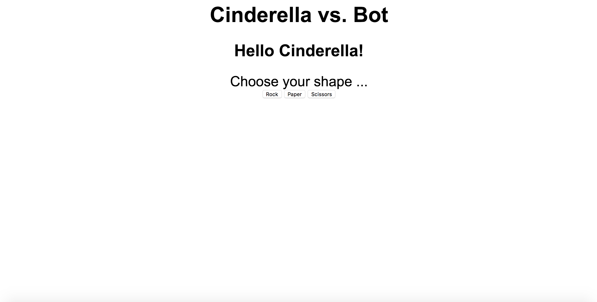
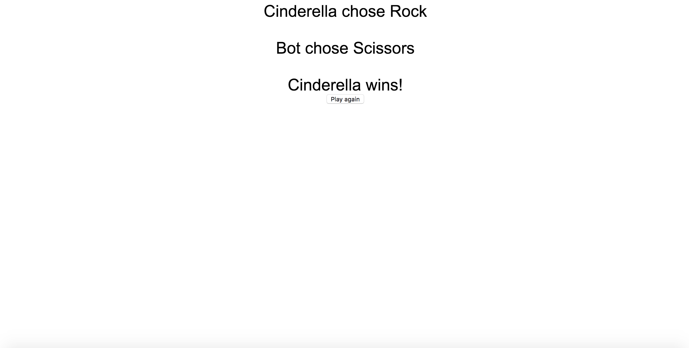

# RPS Challenge

This web application allows users to play the game Rock, Paper, Scissors against the computer.

## Motivations for this project

* Week 3 Makers Academy weekend challenge
* Demonstrate knowledge of Ruby
* Practise TDD - Test drive the app using Capybara and Rspec
* Practise good OOD & Write code that is easy to change
* Practise separation of concerns using the MVC pattern
* Unit test classes in isolation using mocking 
* Stub out random behaviour to ensure feature tests pass consistently

## User Stories

```
As a user
So that I can see my name
I would like to register my name before playing an online game

As a user
I would like to be able to play rock/paper/scissors
```

## Features

* The user can enter their name before the game
* The user will be presented the choices (rock, paper and scissors)
* The user can choose one option
* The computer/bot will choose a random option
* A winner will be declared
* User can click 'Play again' and start a new game

## Approach
* 3 Classes: Player, Game & Computer
* 3 Views: /index, /play & /result
* Aimed to use the MVC pattern to improve the maintainability of the app
* Encapsulated Computer in a separate class to take advantage of duck-typing in the Game class - the game does not need to know if it's comparing two players or one player and a computer!
* This also allows for easy extension of the game to multiplayer. An instance of the Game class is currently being initialised with player_2 equal to an instance of the Computer class:

`def initialize(player_1, player_2 = Computer.new)  
    @player_1 = player_1  
    @player_2 = player_2  
 end`
 
## Getting started

1. clone repo to your local machine `git clone https://github.com/MHUS25/rps-challenge.git`
2. Run the command `gem install bundle` (if you don't have bundle already)
3. When the installation completes, `run bundle`

## Usage

To start the server, execute the ruby file directly `ruby rps_web.rb`
Visit http://localhost:4567/ in your browser to play the game.
Don’t forget to shutdown the server with Control-C when you’re done  =P

## Running tests

Run both feature and unit tests using:
`rspec`

## Screenshots




